# 构建微型MRI：从量子的Ising模型到宏观的Bloch方程

​           																			赵雨洁 物理学院 PB20020487

### 0 背景介绍

MRI作为一种物质分析手段，由于其可深入到物质内部，迅速、准确、分辨率高等优点而得以迅速发展和广泛应用。但MRI实验设备价格昂贵，难以开展普及性实验。针对MRI通过可视化的手段，可以进行虚拟仿真实验，方便教学。本项目针对我校一教大学物理实验中心的MRI机器进行虚拟仿真，有关参数（如磁场、线圈尺寸、物质T1，T2时间等）均适配于一教的MRI机器。针对MRI的磁体部分的自旋磁矩和自发磁性，采用微观的量子Ising模型，模拟粒子磁化过程，复现论文结果；针对粒子自旋在磁场中的运动则采用Bloch方程，模拟了不同脉冲下的序列。通过两种方法尝试图像的边缘提取并选择Canny算子法进行最后的提取。

### 1 微观量子模型

针对MRI磁体部分的磁化现象，采用Ising模型处理其自旋磁矩和自发磁性来探究其粒子自发磁化曲线。

#### 1.0 Ising模型的建立

当一组原子自旋对齐时，它们的相关磁矩都指向同一方向，从而产生宏观尺寸的净磁矩，就会产生*铁磁性。*铁磁性最简单的理论描述称为*伊辛模型*。考虑在z定向磁场强度h中的的N个原子。假设所有原子都是相同的自旋1/2系统。它遵循S=+1/2（自旋向上）或S=-1/2（自旋向下），我们可以引入一个交互作用参数*J_{ij}*，则整个系统的哈密顿量可写成：
$$
\begin{equation}
H = - J\sum_{<i j>}s_i\,s_j -\mu\,h\sum_{i=1,N}s_i.
\end{equation}
$$
由Pauli不相容原理，电子不能占据相同的量子态，因此具有平行自旋（*即*占据相同轨道状态）的相邻原子上的两个电子不能在空间中靠近在一起。这也体现在（1）式第一项中,当相邻原子自旋对齐时总能量降低。第i个粒子的哈密顿量可写为：
$$
\begin{equation}
H_i = -\frac{J}{2}\sum_{k=1,z}s_k\,s_i -\mu\,H\,s_i,
\end{equation}
$$
通过平均场近似，有效磁场可写为：
$$
\begin{equation}
h_{\rm eff} = h + \frac{J}{2\,\mu}\sum_{k=1,z}s_k.
\end{equation}
$$

$$
\begin{equation}
H_i = -\mu\,h_{\rm eff}\,s_i,
\end{equation}
$$

根据玻尔兹曼分布,设体系在温度T中：
$$
\begin{equation}
\bar{s } = \frac{{\rm e}^{+\beta\,\mu\,h_m} - {\rm e}^{-\beta\,\mu\,h_m}}
{{\rm e}^{+\beta\,\mu\,h_m} + {\rm e}^{-\beta\,\mu\,h_m}},\\where\ \ \beta=1/k_{B}T
\end{equation}
$$
将有效磁场（3）式带入，
$$
\begin{equation}
\bar{s} = \tanh(\beta\,\mu\,h_m) = \tanh\left\{\beta\,\mu\,h + \beta\,z\,J\,\bar{s}/2\right\}..\end{equation}
$$
定义
$$
 \begin{equation}
T_c = \frac{z\,J}{2\,k},\ \ \ \ h_c = \frac{k\,T_c}{\mu} = \frac{z\,J}{2\,\mu}.
\end{equation}
$$


则简化为
$$
\begin{equation}
\bar{s} = \tanh\left\{\frac{T_c}{T}\left(\frac{h}{h_c} + \bar{s}\right)\right\}.
\end{equation}
$$
该式无法通过解析解求解，因此我们采用迭代法求解：
$$
\begin{equation}
\bar{s}_{i+1} = \tanh\left\{\frac{T_c}{T}\left(\frac{h}{h_c} + \bar{s}_i\right)\right\}.
\end{equation}
$$


最后可以得到的结果，可以看到平均磁矩会随着温度和磁场突变，那么相变也是Ising模型中我所研究的主题。

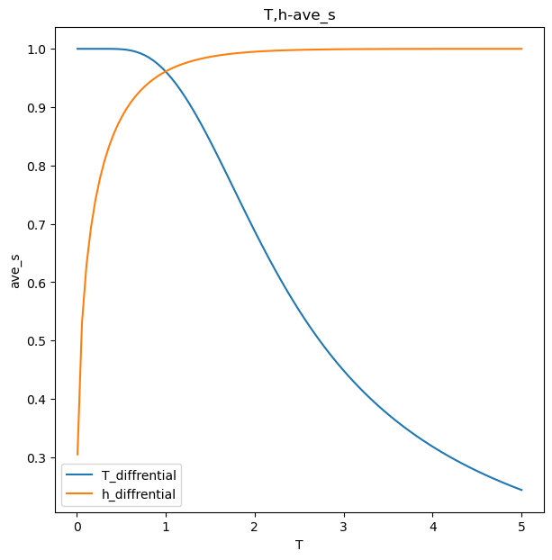

### 1.1 Ising自发磁化曲线

#### 1.1.2 渗流模型

**渗流理论**（Percolation theory）是数学和统计物理领域中研究随机图上簇的性质的一套理论。可抽象成以下数学问题：建立一有n × n个顶点的网格模型，相邻顶点的管道有p的概率是连接的，每条边连接相互独立。上述问题称为**边渗流**。我采用多种方法可视化渗流模型，例如可以直接命令行输出渗流模型，或者gif图输出。

直接cmd运行 python test1.py会直接print p从0-1不断变化的结果


200*200个点的渗流模型，可以在draw.py中选择运行。

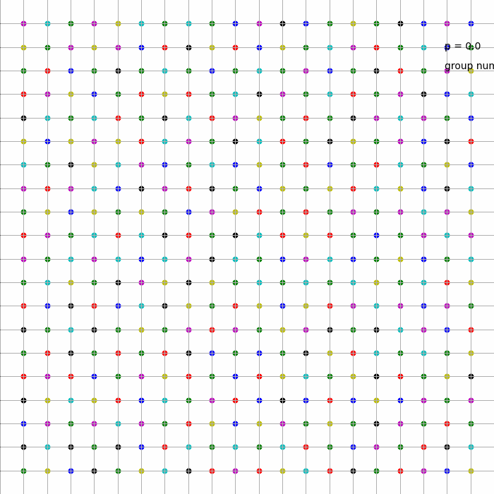

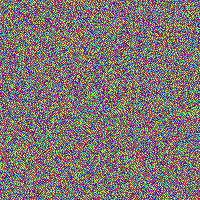

**1.1.2.1 渗流的序参数**

根据朗道相变理论，当体系从一个高对称的相向一个低对称的相转变时，会出现对称破缺，需要额外引入一个或更多的变量来描述系统的态，这些引入的量就是序参数。我通过matplotlib画出group数量和最大group的尺寸。可以看到p=0.5左右，最大group的尺寸发生了突变，可能可以作为序参数之一。通过观察group数量，推测group数量变化率和group最大尺寸随时间的变化率也在P=0.5处突变。推测可能可以作为序参数之一。

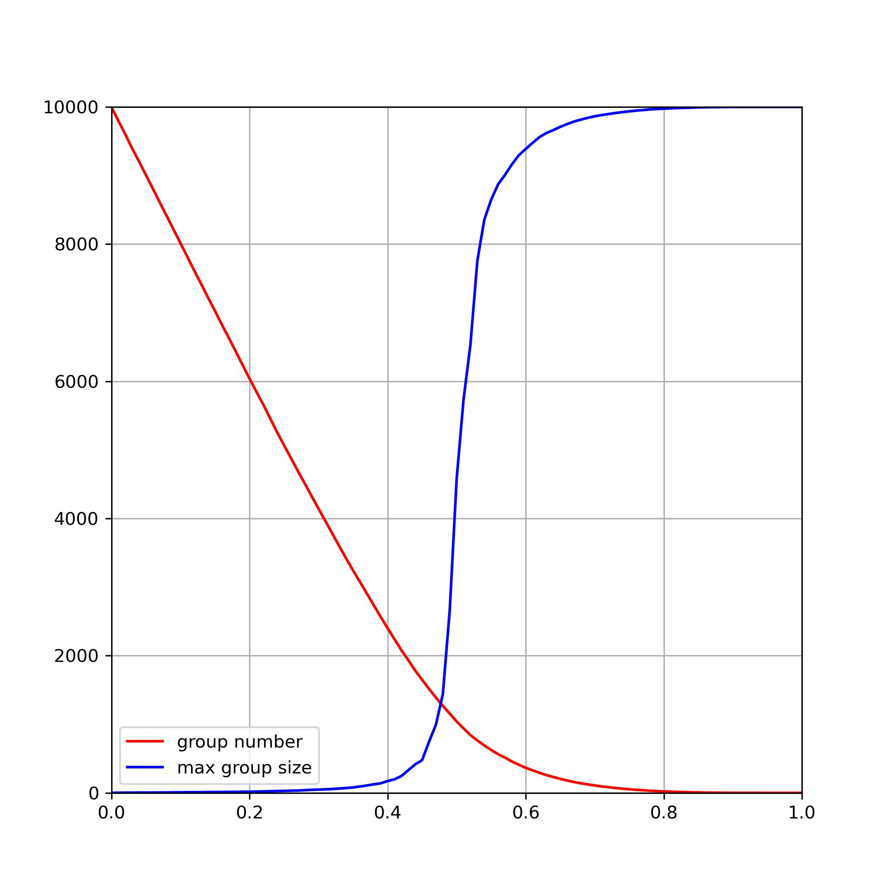


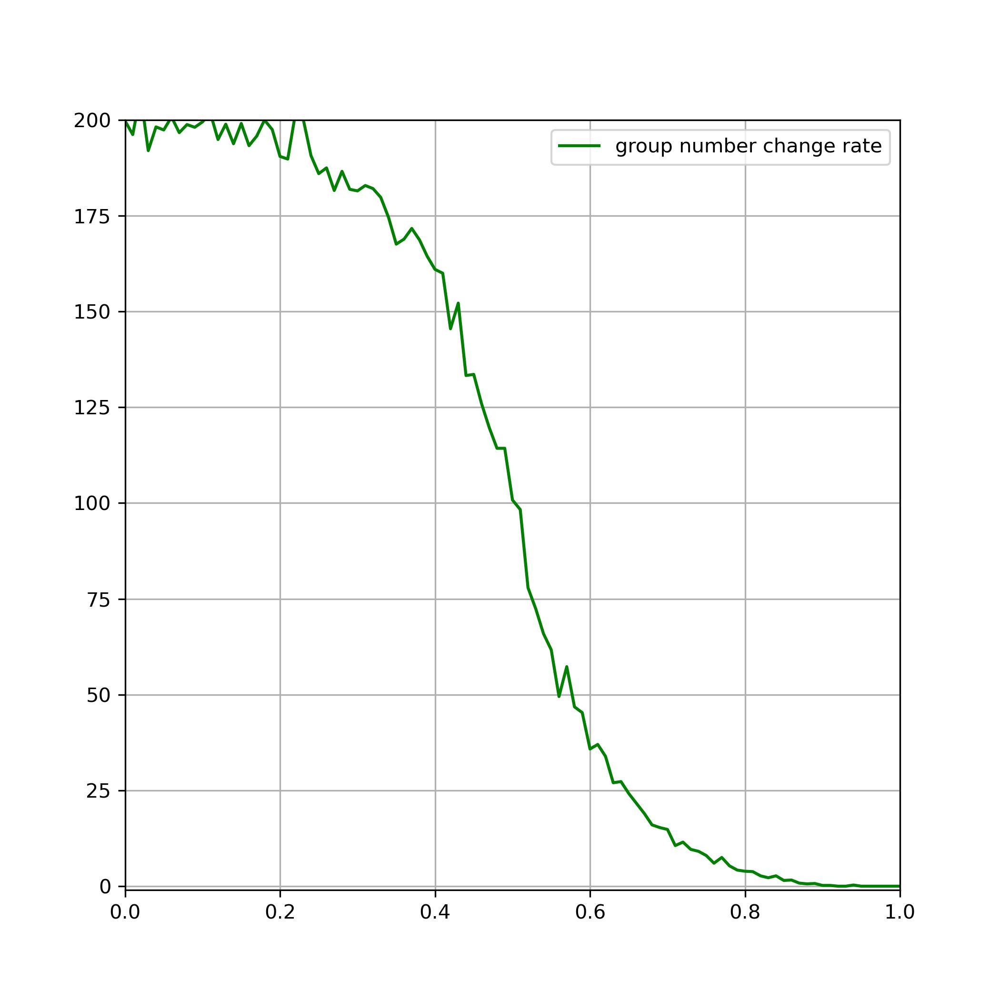

之后在可能的序参数（最大群尺寸和群数量变化率）中进行选择可能的序参数。由于Ising模型在低温等条件下属于非均匀分布，所以我在引入非均匀分布后，发现只有最大群尺寸仍然发生**相变**，所以选择最大群尺寸作为序参数在Ising模型中使用。这也符合Ising模型的自发磁化结果：**所有的粒子自旋都趋向一个方向，只剩下一个群。**

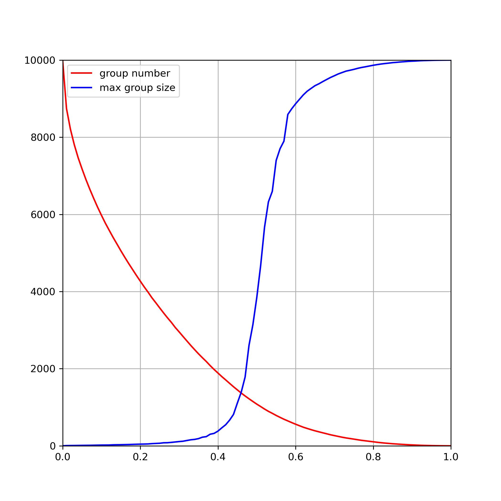

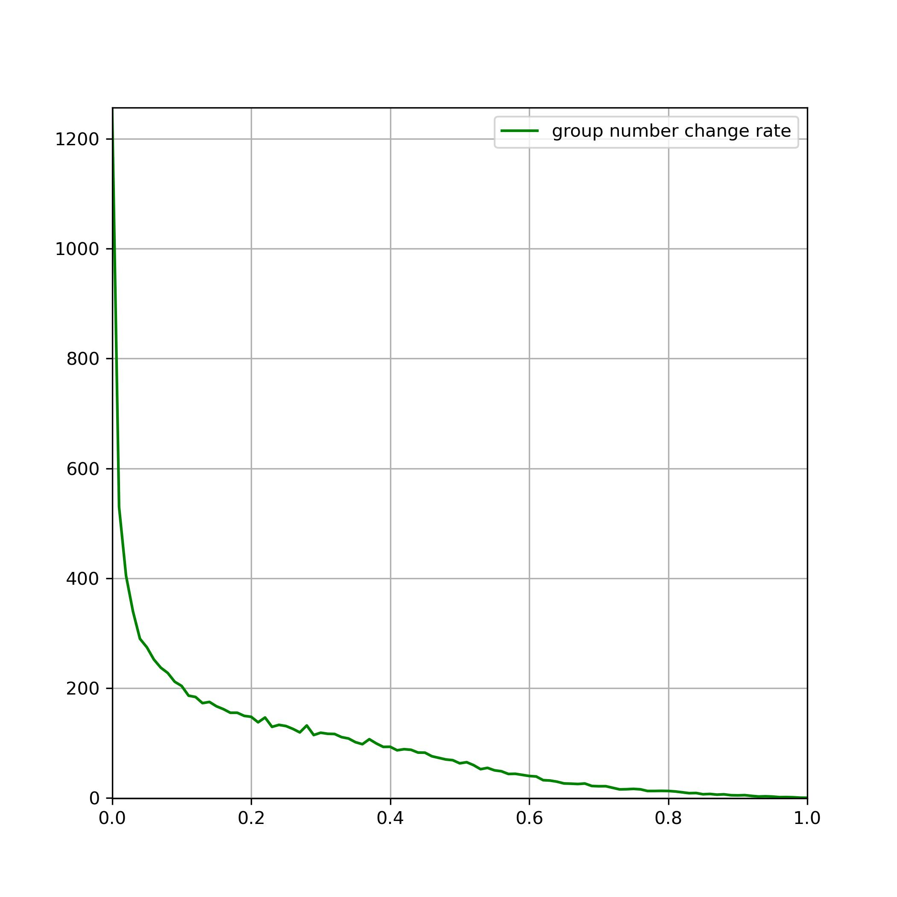

#### 1.1.3用渗流模型来处理Ising模型

   Ising 模型中的相变和晶格渗流模型中的渗流跃迁具有许多共同特征。Ising模型中磁性物质发生的顺磁-铁磁相变，序参数为磁化强度，这和渗流理论有许多相似之处。这促使研究人员探索前者是否是相关渗流模型的渗流跃迁。

​	根据[1]指出，在Ising模型中，系统由含有⼀定程度杂质的铁磁物质组成，即是磁性和⾮磁性的混合物，随机分布在规则的晶格上，具有简单的⽴⽅、正⽅形或线性结构到系统的维度。因此，我们模拟的目标变成在给定外场强度的情况下，求自发磁化曲线，即**磁性原子比例P和自发磁旋百分比的关系**。

**1.1.3.1 核心算法介绍**

1.我们先用迭代法求得已知温度T和磁场强h情况下，上自旋和下自旋的比例。之后采用蒙特卡洛的方法，创建上自旋和下自旋的比例。2.通过Python面向对象编程。为了实现目的，一共定义三个类：IsingNode，IsingGroup，IsingNetwork

IsingNode类：节点，有两个值1，-1，分别表示上自旋和下自旋；周围的四个点是邻居，可以发生相互作用

IsingGroup类：节点所在的群，负责给节点染色，每个群内的节点互相联通，群与群之间不联通。

Network类：表示网络，负责控制群与群之间的行为。处理Ising模型。

2.之前已有的算法判断节点的group属性主要是通过利用Networkx包中的求最大联通图的算法，这种算法的优点在于普适性高，可以求任意拓扑结构的渗流特性。但缺点在于性能低，由于一般来说晶格是规则的二维或立方体。所以我采用的算法是通过在原来的概率p形成的Network上给定一个newp（必须大于p），然后判断两节点是否为同一group，如果不是，则将它们融合。

3.Ising模型强调了neighbor之间的相互作用。作用方式是如果该粒子是磁性物质，则看邻居的磁性属性。如果均为杂质，则保持自己的自旋属性不变；如果邻居全为上自旋或全为下自旋，则自动加入。如果邻居是既有上自旋又有下自旋，则随机挑选一个自旋属性并更新邻居的自旋属性。

如图，蓝色表示上自旋，红色表示下自旋，黑色表示杂质。该动图表现了随着铁磁性物质逐渐升高，在P=59%左右会发生明显的自发磁化（所有磁性物质自旋取向一致）

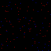

**1.1.3.2 复现论文结果**：

下图fig是参考文献[2]中1D，2D，3D情况下的拟合效果，可以看到，利用Ising的渗透模型研究**磁性原子比例P和自发磁旋百分比的关系**对**相变点**拟合地很好。特别是自发磁化百分比较低的时候，符合文献中相变点1D-32%，2D-53%，3D-96%的效果。而自发磁化较高的时候，曲线拟合情况不佳，推测是Ising模型还要引入外场的作用力部分，即式（1）中的第二项。

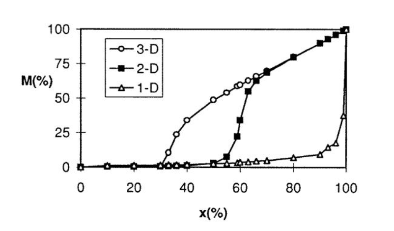

​                   						                                           fig2.1.3.2.1 论文中的自发磁化曲线

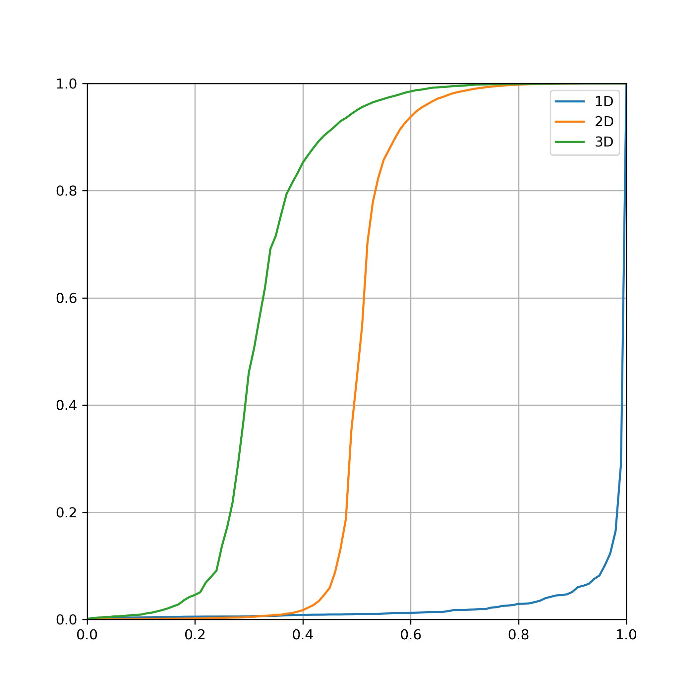

​							                                               fig2.1.3.2.2 笔者的渗透模型拟合的自发磁化曲线


### 2 宏观Bloch方程的模拟

​     接着，我们引入唯象方程：Bloch方程来解释被观测物质的粒子自旋在磁场下的宏观变化。


$$
{\displaystyle {\frac {\partial M_{x}(t)}{\partial t}}=\gamma (\mathbf {M} (t)\times \mathbf {B} (t))_{x} -{\frac {M_{x}(t)}{T_{2}}}}\\
{\displaystyle {\frac {\partial M_{y}(t)}{\partial t}}=\gamma (\mathbf {M} (t)\times \mathbf {B} (t))_{y} -{\frac {M_{y}(t)}{T_{2}}}}\\
{\displaystyle {\frac {\partial M_{z}(t)}{\partial t}}=\gamma (\mathbf {M} (t)\times \mathbf {B} (t))_{z} -{\frac {M_{z}(t)-M_{0}}{T_{1}}}}\\
where,B_{x}=Re[B_{1}e^{i(wt+\phi)}],\\
B_{y}=Im[B_{1}e^{i(wt+\phi)}],\\
w=\gamma B_{0}
$$


​      其中两个参数：T1为纵向弛豫的快慢，主要取决于自旋的原子核与周围分子之间的相互作用情况.这种弛豫的实质是，自旋原子核把从射频脉冲吸收的 量通过与周围晶格的作用传递给周围物质，实现自身能量释放，而从高能级返回至低能级。T2：取决于质子所处的磁场的不均匀性，会发生散相。通过自旋回波来消除散相。

#### 2.1 针对固定粒子的模拟

2.1.1 参考系的选取

对于MRI磁场中的粒子，我们一般将其运动分为Lamor进动和拉比章动，其中Lamor进动满足
$$
\begin{equation}

​		\begin{array}{l}

​			\omega_0=\gamma B_0

​		\end{array}	

​	\end{equation}
$$
所以我们取以Lamor进动频率的旋转参考系后，可以化简Bloch方程为：
$$
{\displaystyle {\frac {\partial M_{x}(t)}{\partial t}}= -{\frac {M_{x}(t)}{T_{2}}}}\\
{\displaystyle {\frac {\partial M_{y}(t)}{\partial t}}= -{\frac {M_{y}(t)}{T_{2}}}}\\
{\displaystyle {\frac {\partial M_{z}(t)}{\partial t}}= -{\frac {M_{z}(t)-M_{0}}{T_{1}}}}\\
$$
此时Bloch方程有了解析解。得到解析解以后再将坐标由旋转坐标系化为实验室坐标系。这和数值求解相比，降低了算法复杂度和提高了精确度。如图是粒子取初磁矩[3,4,0]的情况。

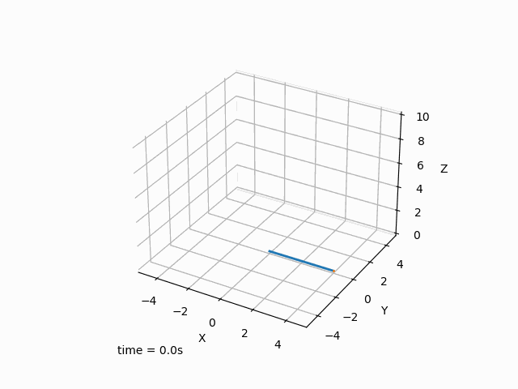

#### 2.2 模拟电磁感应

**2.2.1 引入脉冲序列**

因为每个脉冲序列一般有4～5个脉冲，而每个脉冲的处理方法又基本一致。所以，Python作为面向对象的编程非常适合对MRI的脉冲进行模拟。我采用的文件方法是通过罗老师所教的方法，通过yml进行文件格式读取后建立event对象来描述脉冲的行为。

2.2.1.1SE序列

在反转180度后，磁矩M有关T1的方程可认为：
$$
M_z(t) = M_{z,\mathrm{eq}} - [M_{z,\mathrm{eq}} - M_z(0)]e^{-t/T_1}
\\
IR中，反演初始强度，M_z(0)=-M_{z,\mathrm{eq}}
\\M_z(t) = M_{z,\mathrm{eq}}\left( 1 - 2e^{-t/T_1} \right)
$$
在本实验中取T1=79ms在核磁共振常规脉冲序列当中，反转恢复(inversion recovery, IR)序列是 较为常见的一种序列，反转恢复测Ti序列的基本结构如图3-8-1所示。该序列 首先施加一个180°射频脉冲，使纵向磁化矢量强度Mz反转到主磁场的反方向（—Z轴）上，然后该磁化矢量强度以时间常数进行自由弛豫。经过一定时间后，Mz有所减小，此时沿水平方向上再施加一个90°射频脉冲，检测并记录 此时产生的FID信号。将该序列中180°和90°两个射频脉冲之间的间隔时间定义为反转时间Ti，为反转恢复序列的一个重要参数。

在第一个脉冲序列周期结束后，等待足够长时间，一般需要5Ti时间，以使完全恢复到初始状态。然后重复第一个序列周期的步骤，但立比A延长, 同样在施加90°射频脉冲后，记录下此时FID信号，该信号幅度会随间隔时间变化出现先逐步减小再逐步增加的过程。经过n次实验后，根据每次得到的FID 信号幅值，就能描绘出Mz的恢复曲线（如图3-8-2所示），由此曲线就可以定 出。的值。按照曲线表达式（22）在曲线与横轴的交点处 MzS=0可以得到关于T的表达式：因此，不断改变反转恢复 序列中的P值，并记录每次的FID信号幅值，就能通过软件拟合得到的恢复曲线，从而可以计算得到样品值。

一般来说，电磁信号和磁矩M成正比。而通过变化率，即相对大小变化就能推得T1大小。而只有在x,y方向上才会所以我们只需关注Mx,y的范数大小。

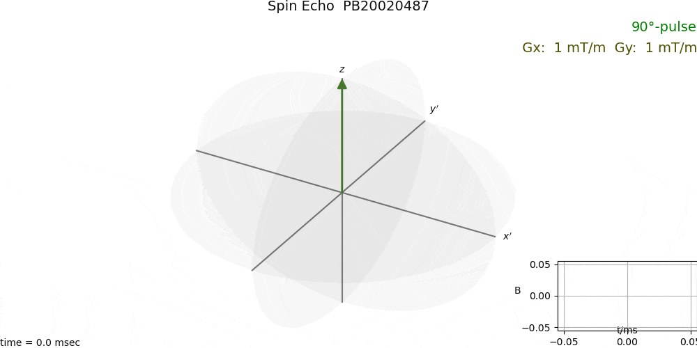

### 3 MRI成像后的图像处理

由于MRI成像后容易分布噪声，我们采用一系列方法进行图像评价和图像的边缘提取。

#### 3.1 边缘提取

3.1.1图像梯度计算

二维图像的梯度其实就是表示两个方向上的变换（差值），利用图像卷积的性质，设置不同的kernel就可以实现对图像两个方向上梯度的计算。因此，设计一个3×3的kernel，由如下方式用来计算图像的梯度以实现图像边缘的计算。发现效果不佳，原因分析，原来高斯噪声过大，需要过滤。同时，梯度最大并不能确定为边缘，还要验证是否为局部最大值，也就是非极大值抑制。下图为

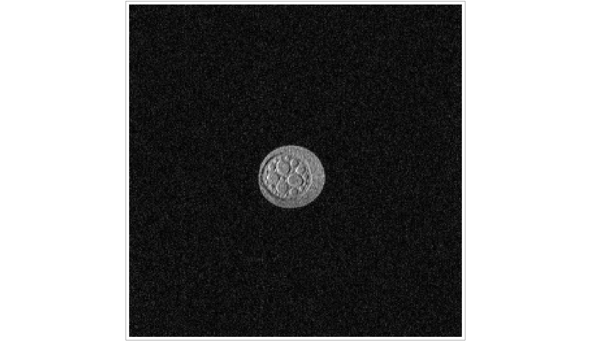

​                                 	fig3.1.1.1 MRI成像原图

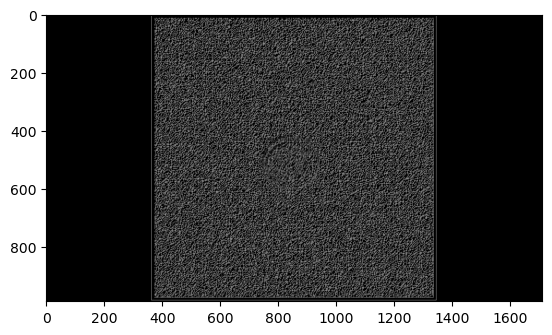

​                                      fig3.1.1.2 MRI梯度成像，效果欠佳

3.1.2.高斯噪声过滤后利用Canny算子

高斯函数为，
$$
g(x)= \frac{1}{\sqrt{2π}σ}e^{-\frac{(x-μ)^{2}}{2\timesσ^{2}}}
$$
高斯滤波所使用的是高斯分布函数的二维形式，来生成高斯滤波的滤波nxn矩阵，为了找到中心点，n应该为奇数。则经过卷积计算得到新的图像的x，y位置的点的灰度值： 
$$
p_{new}(x,y)=(G_{σ}*P_{x,y})(x,y)
$$
接着进行梯度计算，计算的是某个像素点 p(x,y) 的八邻域：

x方向上的梯度幅值为：
$$
g_x = (a_2+2\times a_4+a_7)-(a_0+2\times a_3+a_5)
$$
y方向上的梯度幅值为：
$$
g_y = (a_0+2\times a_1+a_2)-(a_5+2\times a_6+a_7)
$$
则梯度幅值为：
$$
\sqrt{g_x^{2}+g_y^{2}}
$$
梯度方向为：
$$
\theta=tan^{-1}(\frac{g_y}{g_x})
$$
最后进行双阈值的边缘检测和连接这一步，主要想法是将图像转换成非黑即白的边缘图，定义了两个参数：Low和High，若该点的幅值低于Low，则说明不是边缘点，去除掉，置为黑色，若该点的幅值高于High，则说明是边缘点，加强，置为白色；若该点的幅值在Low和High之间，则：如果 该点直接与幅值大于High的点相，认为该点处于边缘上，是边缘点，置为白色。否则，则认为不是边缘点，置为黑色。

针对一教的MRI机器进行高斯过滤加canny算子梯度计算，调试参数后认为low对结构几乎无影响。n=15，high=75时，得到的边界提取图像最佳。下图为不同参数下边缘提取的结果。

n=7,high=70

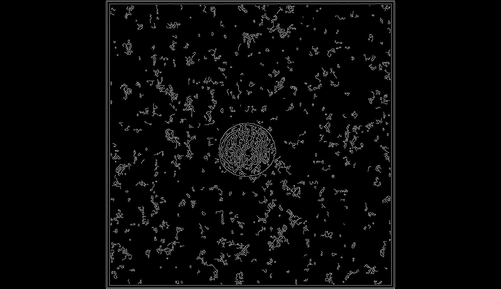

n=15,high=75，效果最佳


n=15,high=100

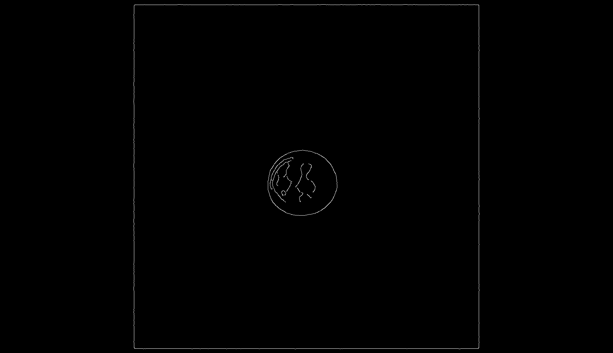


### 4 创新性：

代码参考部分：Bloch方程的可视动画框架和Canny算法实现

其余均由本人独立完成，且所有算法根据我校大物实验中心的仪器参数进行调整。完整地复现了MRI的成像过程。

**Ising模型**

分析磁体时，我发现渗流和Ising模型的相似性，通过查阅论文将渗流模型引入Ising模型，取得了很好的模拟效果。

|               原有渗透算法               | 自主创新                                                     |
| :--------------------------------------: | ------------------------------------------------------------ |
|   对于每个P都要重新产生随机数进行判断    | 利用蒙特卡洛的方法，将每一个边值先按特定的概率分布产生随机数，利用了一开始P=0时每个网格独立的先决条件，研究随着P的变化渗流的变化，并可以动态展示 |
|                                          |                                                              |
|         只研究了（0，1）均匀分布         | 研究了其它类型的分布（关于P=0.5对称），如f(x)=sin(pi*x)/2的分布 |
| 利用求最大联通子图的方法求出不同群的分布 | 利用一开始P=0每个格点为一个簇的性质，通过边界的打开闭合来进行随着P的变化边界的调整 |
|           跑20个点所用时间120s           | 跑20个点所用时间<10s                                         |
|               研究了2D模型               | 研究了2D和3D模型                                             |

用了多种可视化方式将Ising模型和渗透理论相结合，用Python复现了经典论文的结果。

**Bloch方程模型**

用**不同的坐标系**下的Bloch方程从数值解和解析解两种可视化模型并比较后选择旋转参考系。所有的Bloch参数包括磁场、脉冲相位、缓冲时间均根据我校一教物理实验中心的MRI机器所建立，其模型的严谨程度也得到大物实验老师的认可。有助于之后的教学工作。

**图像处理**

通过调研集成了不同的图像边缘提取算法，比较了不同的图像处理算法针对MRI的应用的优劣性，针对MRI进行了参数的调整，取得了较好的效果。

### 5 算法优化过程

1.可视化优化时，原来采用matplotlib进行绘制动态gif图，后来发现matplotlib性能不佳，20*20的点就要跑160s左右。经过查找资料后采用pil包直接输出图像后性能提高，20 *20的点仅需几s就可完成，而且可以更加直观：每帧都会立刻输出，所以可以定性知道程序运行时间p随时间的变化。

2.处理大数据点（1000*1000）时，发现到p=0.5后发生了程序运行时间发生了“相变”。经过分析发现，原来的network对象的connect函数是把两个比较节点（node1，node2）所在group的所有group属性都给更新一遍，这样的话在p=0.5以后，由于最大的group已经蔓延到了边界非常大，而产生了很多不必要的重复计算。

更新前：

```python
def connect(self,pipe):
        pipe.state=1
        if pipe.isboundary():
            new_group=self.groups[pipe.node1.group].merge(self.groups[pipe.node2.group])
            new_index=self.register_group(new_group)
            self.groups.pop(pipe.node1.group)
            self.groups.pop(pipe.node2.group)
            for node in new_group.set:
                node.group=new_index
```

所以，采用的修改方法是只修改需要更新的属性：

```python

def connect(self,pipe):
        pipe.state=1
        if pipe.isboundary():
            pop_index=self.groups[pipe.node1.group].merge(self.groups[pipe.node2.group])
            self.groups.pop(pop_index)
            return 1
        return 0
```


### 6 心得体会：

1.通过Python强大的科学软件包PIL，matplotlib可以进行非常多科学数据可视化的展示，进行动态帧动画的设计、制作，可以更加生动直观的展示不同参数的变化。同时，可以灵活通过多个角度分析，譬如读取文件最后修改时间来分析算法。

2.通过Python，我可以将自己的很多想法得以可视化验证。比如对序参数的研究和不同算法的性能比较，更方便自己对算法和模型的改进。

3.这学期选了数据结构和离散数学课，但通过这次作业，将数据结构和图论的一些知识能够结合起来。之前数据结构主要是用C实现，这次用Python实现，感觉更自由、便捷和灵活。不同的数据结构可能对算法复杂度有很大的影响。

4.数学理论证明可能比较抽象和困难，一开始可以通过程序运行统计结果来定量分析，获得灵感和思路。渗透模型一类的基础模型在很多领域都有所作用。


### 7 代码封装

1.test1.py 构建渗透模型、cmd输出，test1_draw.py 渗透模型可视化输出

2.Ising_draw.py Ising模型的可视化，Ising_result.py Ising模型的评价

3.bloch.py方程为Bloch模型，bloch_draw为其可视化代码

4.canny.py包括梯度方法和canny算子方法两种方法的边缘提取方法


### 8 参考文献：

[0]https://zhuanlan.zhihu.com/p/47017516

[1]Percolation, clusters, and phase transitions in spin models

[2]Chin-Kun Hu,Phys. Rev. B **29**, 5103 – Published 1 May 1984

### 9 运行结果

**注：老师有些结果是我选择函数运行生成的，而不是直接运行Python即可生成**

0. ising_ave.py

   

1. test1.py


 2.test1_draw.py


3.bloch.py


4. img_assess.py

   

   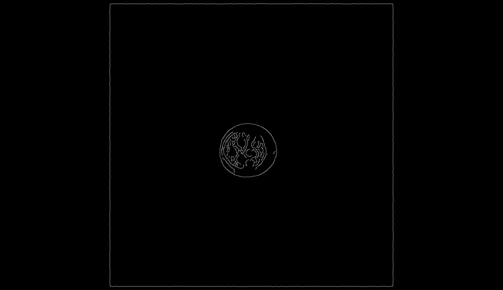