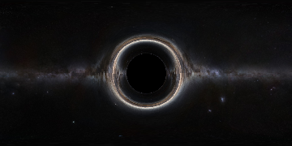
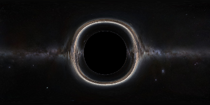

# 黑洞可视化模拟程序

计算机学院 PB20051001 杨嘉骐

## 科学技术原理

黑洞（英文：Black Hole）是现代广义相对论中，存在于宇宙空间中的一种天体。黑洞的引力极其强大，使得视界内的逃逸速度大于光速。故而，黑洞是时空曲率大到光都无法从其事件视界逃脱的天体。

根据广义相对论，大质量物体会引起时空的扭曲，其一个重要体现就是光的引力透镜效应。也就是说，像黑洞这样的大质量物体会引起远方背景发出的光线弯折，从而其改变其视觉形象。借助数学工具，在本次实验中我将会尝试模拟一个非旋转黑洞(史瓦西黑洞)存在时的视觉形象。

黑洞的广义相对论描述过于复杂，但根据黑洞的对称性，模拟黑洞的视觉形象只需要获得黑洞一条半径所在射线上的光线轨迹。查阅资料可得此时描述光子轨迹的常微分方程如下:

$$\frac{\mathrm{d}^2u}{\mathrm{d}\phi^2} - \frac{3 R_s u^2}{2} + u = 0 $$

其中 $u(\phi)=\frac{1}{r(\phi)}$ 且 $ R_s = \frac{2MG}{c^2} $. $R_s$ 是黑洞的视界半径。

将其转化为两个一阶方程:

$$ v_0 = u[1] $$

$$ v_1 = \frac{3 R_s}{2}u[0]^2-u[0] $$

其中 $ u[0] = u[\phi] $ 且 $ u[1] = \frac{\mathrm{d}u}{\mathrm{d}\phi} $.

边界条件有:

$$ v_0(0) = \frac{1}{D} $$

$$ v_1(0) = \frac{1}{D\tan(\alpha)} $$

差分方程的解对应的可视角度与偏转角度之间的关系如下:

$$ \mathrm{seen\_angle} = \pi - \alpha $$

$$ \mathrm{deviated\_angle} = \phi + \alpha \sin(\frac{D}{R}\sin(\phi)) $$
这样, 就可以借助scipy.integrate.solve_ivp等函数来求解这个微分方程，获得每个点上对应的光线偏转角度了。求解完成后，利用插值法等方法将一条轨迹上的路径应用到所有像素上，得到变换后所有像素的位置，计算出最终的图像。

## 设计思路

- 使用 Python 科学计算库中的Scipy、Numpy等库进行向量和矩阵的计算，并使用PIL库进行图像处理
- 设计 Blackhole 类，承载计算的主体。
- 在 Blackhole 类内的compute函数中承载计算逻辑。
- 首先通过上述的轨迹方程，求解出一条径向路径上的光子运动轨迹，返回可视角度与偏转角度之间的对应关系
  - 根据serach_alpha_min函数计算其关于黑洞的张角alpha，求出光线来源的范围
  - 对于每个alpha求解微分方程、计算光子轨迹。调用scipy.integrate.solve_ivp求解差分方程的数值解。
  - 将结果转换为球坐标
- 之后通过插值法，借助numpy库进行矩阵变换，将一条路径上的角度应用到图片的所有像素上，获得偏转矩阵。
- 最后将这个偏转矩阵应用到原始图像上，通过PIL库进行图片的转化，得到最终的黑洞的视觉图像

## 创新性描述

本次实验利用广义相对论对于光受到大质量物体而偏折的计算公式，设计实现了计算黑洞的视觉形象的程序。

在代码中利用黑洞本身的对称性，仅计算一条径向的光线偏折规律，无需对图像上每个点进行一次计算，提高了计算效率，减少了运行时间。

利用插值等方法，将图像的变换转化为矩阵的变换，从而能够借助scipy等库实现计算的加速，并最终方便地应用到最终图像中。

同时，本实验中实现的计算黑洞的视觉形象的代码，同样适合计算宇宙中一切大质量物体产生的引力偏折效应，具有应用的普适性。

## 运行方法和结果

运行 `Blackhole.py` ，在运行开始前可以在main中修改背景图片、黑洞大小(以天文单位为单位)和黑洞离观测者的距离(以天文单位为单位)。

运行时，程序会在控制台输出生成的黑洞对应的各项信息和产生图像的计算时间。

以8天文单位为黑洞大小，距离观察者50天文单位生成的图像如图:

修改黑洞的大小和距离可以产生不同的结果,例如将黑洞大小改为12天文单位:

可以看到，图片正确地模拟了在一个大质量黑洞附近看到的光线弯折现象。

## 学习心得收获

- 通过本次课程，从基础开始完整学习了Python的基本语法结构，初步掌握了Python的强大科学计算能力。
- 通过本次实验，完整的写出了一个较大型的Python程序，将科学方程式转换为代码的能力大大提高，代码能力和代码风格得到了有效提升
- 通过本次实验，掌握了更多Python科学计算库的用法

## 参考资料

罗奇鸣. (2022). Python科学计算基础.

How to draw a Black Hole [https://rantonels.github.io/starless/](https://rantonels.github.io/starless/)
